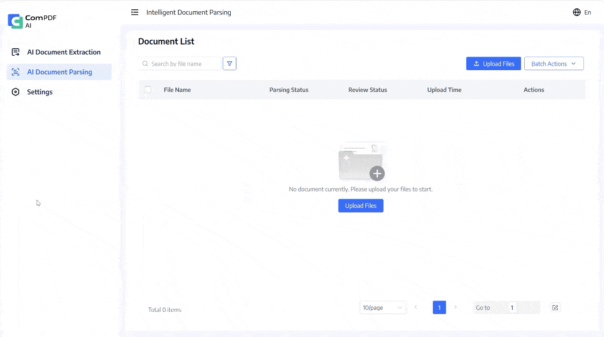
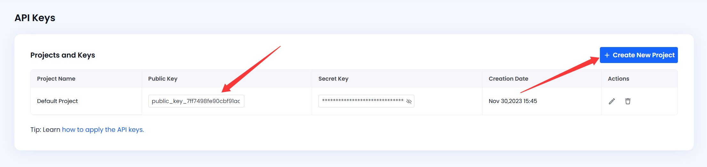

[English](README.md) | [繁體中文](README_TW.md) | [简体中文](README_CN.md)

# DocSlight - An Open-source Document Parser & Document Data Extraction Engine

Part of the KDAN ecosystem, [DocSlight](https://www.compdf.com/ai/docslight?utm_source=github_ai_docslight_oldopen&utm_medium=referral&utm_campaign=github_ai_docslight_oldopen&ref_platform_id=github_compdf) offers document parsing, OCR, and data extraction that turn PDFs, scans, images, and Office files into structured outputs for RAG pipelines, AI agents, and enterprise document automation.

> - If you find DocSlight useful, please consider giving us a ⭐ **Star** on GitHub. It helps us grow and improve.
> - Got questions or ideas? Join the conversation in our [Discussions](https://github.com/ComPDFKit/docslight/discussions).

<p align="center">
  <a href="#"></a>
  <a href="#"></a>
  <a href="#"></a>
  <a href="#"></a>
  <a href="#"></a>
</p>

<p align="center">
  <a href="#quick-start"><b>Quick Start</b></a> •
  <a href="#product-editions"><b>Product Editions</b></a> •
  <a href="#usage"><b>Usage</b></a> •
  <a href="#benchmark"><b>Benchmark</b></a> •
  <a href="https://compdf.com" target="_blank"><b>Cloud API →</b></a> •
  <a href="https://www.compdf.com/guides/api-reference/v2/ai/overview?utm_source=github_ai_docslight_oldopen&utm_medium=referral&utm_campaign=ai_docslight_open&ref_platform_id=github_compdf_en" target="_blank"><b>Documentation</b></a>
</p>

## Why DocSlight?

Unlike traditional OCR tools, DocSlight combines AI-powered document parsing, OCR for 80+ languages, and structured data extraction into a single open-source platform. You can deploy it locally or use it via cloud API with higher accuracy.

### Key Advantages

- Open-source document data extraction engine with no vendor lock-in
- OCR for 80+ languages with multilingual auto-detection
- Structured field extraction with bounding-box traceability
- Markdown / JSON output for downstream processing
- Web UI + CLI + Python SDK
- Local deployment or Cloud API
- Built for RAG, AI Agents, and enterprise document workflows

### Perfect For

- RAG pipelines and knowledge base construction
- Invoice processing and document information extraction
- Contract analysis and clause parsing
- AI copilots and AI agent tool integration
- Enterprise document automation and intelligent document processing (IDP)

Whether you're building a personal RAG project or a large-scale enterprise document automation system, DocSlight provides a scalable foundation for document understanding.




## Quick Start

### Cloud Mode (Higher accuracy, free quota available)

```bash
# 1. Install
pip install docslight

# 2. Set your API key
export COMPDF_API_KEY="your_public_key"    # Get one at https://compdf.com

# 3. Parse with the cloud engine
docslight parse invoice.pdf --mode cloud --output invoice.md
```

**Get the API Key:** [Log in to the ComPDF Console](https://www.compdf.com/compdf-portal/signin?utm_source=github_ai_docslight_oldopen&utm_medium=referral&utm_campaign=ai_docslight_open&ref_platform_id=github_compdf_en). On the API Key page, create or copy your publicKey.



### Local Mode (Free, no registration required)

```bash
# 1. Install
pip install docslight

# 2. Parse a document
docslight parse invoice.pdf --mode local --output invoice.md

# 3. Get structured results
ls invoice.zip
```


### Web UI (Browser)

```bash
git clone https://github.com/ComPDF/docslight.git

cd docslight

docker compose -f docker/docker-compose.yml up
# Open http://localhost:3022 and drag & drop files
```

All features above come with [ComPDF](https://www.compdf.com/?utm_source=github_ai_docslight_oldopen&utm_medium=referral&utm_campaign=ai_docslight_open&ref_platform_id=github_compdf_en) — check them out [here](https://www.compdf.com/demo/idp/document-parsing?utm_source=github_ai_docslight_oldopen&utm_medium=referral&utm_campaign=ai_docslight_open&ref_platform_id=github_compdf_en).


## Product Editions

> Need workflow automation, RBAC, audit logs, private deployment, or dedicated support? **Explore Enterprise:** [https://www.compdf.com/ai/docslight](https://www.compdf.com/ai/docslight?utm_source=github_ai_docslight_oldopen&utm_medium=referral&utm_campaign=ai_docslight_open&ref_platform_id=github_compdf_en)

| Feature                                                           | DocSlight Lite (Local) | DocSlight-Lite (Cloud) | DocSlight Enterprise (SaaS) | DocSlight Enterprise (Self-hosted Deployment) |
| ----------------------------------------------------------------- |:----------------------:|:----------------------:|:---------------------------:|:---------------------------------------------:|
| Upload Files from Local                                           | ✅                      | ✅                      | ✅                           | ✅                                             |
| Upload Files from Cloud                                           | ❌                      | ❌                      | ✅                           | ✅                                             |
| Upload Files from DMS                                             | ❌                      | ❌                      | ✅                           | ✅                                             |
| Upload Files from Scanner                                         | ❌                      | ❌                      | ✅                           | ✅                                             |
| PDF Parsing                                                       | ✅                      | ✅                      | ✅                           | ✅                                             |
| Image Parsing                                                     | ✅                      | ✅                      | ✅                           | ✅                                             |
| Word / PPT / Excel Parsing                                        | ✅                      | ✅                      | ✅                           | ✅                                             |
| Markdown Output                                                   | ✅                      | ✅                      | ✅                           | ✅                                             |
| JSON Output                                                       | ✅                      | ✅                      | ✅                           | ✅                                             |
| PDF Extraction                                                    | Local LLM Required     | ✅                      | ✅                           | ✅                                             |
| Image Extraction                                                  | Local LLM Required     | ✅                      | ✅                           | ✅                                             |
| Word / PPT / Excel Extraction                                     | Local LLM Required     | ✅                      | ✅                           | ✅                                             |
| Legacy Office Formats for Parsing and Extraction (.doc/.ppt/.xls) | ❌                      | ✅                      | ✅                           | ✅                                             |
| Batch Processing                                                  | ✅                      | ❌                      | ✅                           | ✅                                             |
| Auto Classification                                               | ❌                      | ❌                      | ✅                           | ✅                                             |
| Human Review Workflow                                             | ❌                      | ❌                      | ✅                           | ✅                                             |
| Complex Layout Analysis                                           | Basic                  | Advanced               | Advanced                    | Advanced                                      |
| OCR Optimization                                                  | Basic                  | Advanced               | Advanced                    | Advanced                                      |
| Result Traceability                                               | ❌                      | ❌                      | ✅                           | ✅                                             |
| Result Post-Processing                                            | ❌                      | ❌                      | ✅                           | ✅                                             |
| Intelligent Result Review                                         | ❌                      | ❌                      | ✅                           | ✅                                             |
| Custom Rule-Based Alerts                                          | ❌                      | ❌                      | ✅                           | ✅                                             |
| Webhook Integration                                               | ❌                      | ❌                      | ✅                           | ✅                                             |
| API Management                                                    | ❌                      | Limited                | ✅                           | ✅                                             |
| Knowledge Base Integration                                        | ❌                      | ❌                      | ✅                           | ✅                                             |
| Audit Logs                                                        | ❌                      | ❌                      | ✅                           | ✅                                             |
| RBAC                                                              | ❌                      | ❌                      | ✅                           | ✅                                             |
| Tenant Support                                                    | ❌                      | ❌                      | ❌                           | ✅                                             |
| Self-hosted Deployment                                            | Local Only             | ❌                      | ❌                           | ✅                                             |
| Dedicated GPU                                                     | ❌                      | ❌                      | Optional                    | ✅                                             |


## Input/Output Format Matrix

| Input type | Extensions | Cloud parse | Local parse | Cloud extract | Local extract | Parse outputs | Extract outputs | Notes |
| ---------- | ---------- |:-----------:|:-----------:|:-------------:|:-------------:| ------------- | --------------- | ----- |
| PDF | `.pdf` | ✅ | ✅ | ✅ | ✅ Requires local LLM | Markdown, JSON, standard JSON, ZIP | JSON | Local PDF parsing uses raster/OCR processing. |
| Images | `.png`, `.jpg`, `.jpeg`, `.tif`, `.tiff`, `.bmp`, `.webp` | ✅ | ✅ | ✅ | ✅ Requires local LLM | Markdown, JSON, standard JSON, ZIP | JSON | Local image parsing treats each image as one page. |
| Word | `.docx` | ✅ | ✅ | ✅ | ✅ Requires local LLM | Markdown, JSON, standard JSON, ZIP | JSON | Local legacy `.doc` is not supported. |
| PowerPoint | `.pptx` | ✅ | ✅ | ✅ | ✅ Requires local LLM | Markdown, JSON, standard JSON, ZIP | JSON | Local legacy `.ppt` is not supported. |
| Excel | `.xlsx` | ✅ | ✅ | ✅ | ✅ Requires local LLM | Markdown, JSON, standard JSON, ZIP | JSON | Local legacy `.xls` is not supported. |
| Legacy Office | `.doc`, `.ppt`, `.xls` | Cloud API dependent | ❌ | Cloud API dependent | ❌ | Cloud result formats | JSON | Convert to `.docx`, `.pptx`, or `.xlsx` before local processing. |

`docslight convert-parse-json` accepts a local parse JSON object and writes the standard parse JSON schema. It does not process original document files.


## Installation And First Run

DocSlight supports Python 3.10 through 3.13.

```bash
pip install "docslight"
```

Cloud mode requires network access and a valid ComPDF Cloud API key. Local mode runs on CPU by default; OCR and LLM latency depends on document size, hardware, and the selected model.


## Use Cases

- **RAG Pipeline** — Parse documents -> embed vectors -> query with an LLM
- **Invoice Processing** — Extract invoice numbers, dates, totals, and line items
- **Contract Analysis** — Parse clauses, parties, and dates with bounding-box traceability
- **Document Digitization** — Batch convert scanned archives into searchable text
- **AI Agent Integration** — Provide MCP-based document reading for Claude / ChatGPT

Runnable example code is available in [`examples/`](docslight_lite/examples/):

- [`cloud_parse.py`](docslight_lite/examples/cloud_parse.py)
- [`cloud_extract.py`](docslight_lite/examples/cloud_extract.py)
- [`local_parse.py`](docslight_lite/examples/local_parse.py)
- [`local_extract_ollama.py`](docslight_lite/examples/local_extract_ollama.py)
- [`local_extract_openai_compatible.py`](docslight_lite/examples/local_extract_openai_compatible.py)
- [`path_examples.py`](docslight_lite/examples/path_examples.py)


## Usage

### Python SDK

```python
from docslight import Parser

# Local mode — open-source OCR and document parsing
parser = Parser(mode="local")
result = parser.parse("contract.pdf")
print(result.text)                    # Full Markdown text
print(result.metadata)                # Pages, blocks, bounding boxes

# Cloud mode — higher-accuracy PDF parsing
parser = Parser(mode="cloud", api_key="your_key")
result = parser.parse("invoice.pdf")
print(result.text)
print(result.tables)                  # Structured table data
print(result.blocks[0].bbox)          # Bounding-box traceability
```

### CLI

```bash
# Parse a PDF to Markdown
docslight parse document.pdf --mode cloud -o document.md

# Parse to JSON or standard JSON
docslight parse scan.png --mode cloud --format json -o scan.json
docslight parse scan.png --mode cloud --format standard-json -o standard.json

# Parse and write a ZIP archive
docslight parse invoice.pdf --mode local --format zip -o invoice.zip

# Field extraction (cloud mode)
docslight extract invoice.pdf --mode cloud --fields invoice_no,date,total
docslight extract invoice.pdf --schema schema.json
docslight extract invoice.pdf --document-types document-types.json

# Local LLM extraction
docslight extract invoice.pdf --mode local --fields invoice_no,total --local-llm-provider ollama --local-llm-model llama3.1

# Convert local parse JSON to standard parse JSON
docslight convert-parse-json parse.json -o standard.json

# Start the local API server
docslight web --host 127.0.0.1 --port 8000 --debug
```

#### CLI commands

```bash
docslight parse INPUT [OPTIONS]
docslight extract INPUT [OPTIONS]
docslight convert-parse-json INPUT [OPTIONS]
```

#### Common parse/extract options

| Option | Values / default | Description |
| ------ | ---------------- | ----------- |
| `INPUT` | File path | Document path to process. |
| `--mode` | `cloud`, `local`; default from config/env or `cloud` | Select ComPDF Cloud or local offline processing. |
| `--api-key` | String | Cloud API key. Overrides `COMPDF_API_KEY`. |
| `--base-url` | URL; default `https://api-server.compdf.com` | Cloud API base URL. Overrides `DOCSLIGHT_BASE_URL`. |
| `--local-parser` | String | Local parser selector. Currently reserved for local parser configuration. |
| `--local-llm-provider` | `ollama`, `openai`, `openai-compatible`; default `ollama` when any local LLM option is used | Local extraction LLM provider. |
| `--local-llm-model` | String | Local extraction LLM model. Required for local LLM extraction. |
| `--local-llm-base-url` | URL | Local LLM endpoint. Ollama defaults to `http://localhost:11434`; OpenAI-compatible providers require this value. |
| `--local-llm-api-key` | String | Local LLM API key. Ollama defaults to `ollama`. |

#### parse options

| Option | Values / default | Description |
| ------ | ---------------- | ----------- |
| `--output`, `-o` | File path | Write output to a file instead of stdout. |
| `--format` | `markdown`, `json`, `standard-json`, `zip`; default `markdown` | Output format. If omitted and `--output` ends with `.zip`, DocSlight infers `zip`. |

`markdown` writes parsed Markdown. `json` writes the SDK parse result. `standard-json` writes the standard parse JSON schema. `zip` writes the raw parse archive and should normally be used with `--output`.

#### extract options

| Option | Values / default | Description |
| ------ | ---------------- | ----------- |
| `--output`, `-o` | File path | Write extracted JSON to a file instead of stdout. |
| `--fields` | Comma-separated names, for example `invoice_no,total` | Fields to extract. |
| `--schema` | JSON file path | Extraction schema JSON file. The CLI reads this file and passes the JSON object to `extract`; a common schema is `{"fields": ["invoice_no", "date", "total"]}`. JSON Schema-style objects with `properties` are also accepted. |
| `--document-types` | JSON file path | Document type routing file. The JSON root must be a list, for example `["invoice", "receipt"]`. |

Example `schema.json`:

```json
{
  "fields": ["invoice_no", "date", "total"]
}
```

#### convert-parse-json options

| Option | Values / default | Description |
| ------ | ---------------- | ----------- |
| `INPUT` | JSON file path | Local parse JSON payload to convert. The JSON root must be an object. |
| `--output`, `-o` | File path | Write converted standard parse JSON to a file instead of stdout. |

#### Environment variables and config file

| Variable | Description |
| -------- | ----------- |
| `COMPDF_API_KEY` | API key for cloud mode. |
| `DOCSLIGHT_MODE` | Processing mode: `cloud` or `local`; default `cloud`. |
| `DOCSLIGHT_BASE_URL` | Cloud API base URL; default `https://api-server.compdf.com`. |
| `DOCSLIGHT_TIMEOUT` | Cloud request timeout in seconds; default `30`. |
| `DOCSLIGHT_LOCAL_PARSER` | Local parser selector. |

DocSlight also reads `~/.docslight/config.toml`. Values are applied in this order: built-in defaults, config file, environment variables, then explicit SDK or CLI arguments.

```toml
mode = "cloud"
api_key = "your-api-key"
base_url = "https://api-server.compdf.com"
timeout = 30
local_parser = "paddleocr"  # reserved for local parser configuration

[local_llm]
provider = "ollama"
model = "llama3.1"
base_url = "http://localhost:11434"
api_key = "ollama"
timeout = 120
```

The CLI exposes the main local LLM settings as flags. Advanced local LLM provider settings such as `extra_body` are available through the SDK or `~/.docslight/config.toml`.

### Docker

```bash
git clone https://github.com/ComPDF/docslight.git

cd docslight

docker compose -f docker/docker-compose.yml up
# Open http://127.0.0.1:3022
```


## Comparison

| Capability            | DocSlight | MinerU | PDF-Extract-Kit | ExtractThinker |
| --------------------- |:---------:|:------:|:---------------:|:--------------:|
| PDF Parsing           | ✅         | ✅      | ✅               | ⚠️             |
| OCR Support           | ✅         | ⚠️     | ✅               | ❌              |
| Data Extraction       | ✅         | ❌      | ❌               | ✅              |
| Web UI                | ✅         | ❌      | ❌               | ❌              |
| CLI                   | ✅         | ✅      | ✅               | ❌              |
| Python SDK            | ✅         | ✅      | ✅               | ⚠️             |
| Cloud API             | ✅         | ❌      | ❌               | ❌              |
| Enterprise Deployment | ✅         | ❌      | ❌               | ❌              |
| Markdown Output       | ✅         | ✅      | ✅               | ⚠️             |
| JSON Output           | ✅         | ✅      | ✅               | ✅              |
| Multi-language OCR    | ✅         | ⚠️     | ⚠️              | ❌              |
| Commercial Support    | ✅         | ❌      | ❌               | ❌              |


## Architecture

```text
┌─────────────────────────────────────────────────────────────────────────────────┐
│                      DocSlight Open-Source Document Parser & Extractor           │
│                        （LGPL License | Local + Cloud Dual Mode）               │
└─────────────────────────────────────────────────────────────────────────────────┘
                                      │
                                      ▼
┌─────────────────────────────────────────────────────────────────────────────────┐
│                        Access Layer（Entry Points）                            │
├─────────────────────────────────────────────────────────────────────────────────┤
│                                                                                 │
│  ┌──────────────────────────┐   ┌────────────────────────┐  ┌───────────────────┐ │
│  │  Docker Web UI（Primary） │  │          CLI            │  │    Python SDK     │ │
│  │  One-click container     │  │      Command Line       │  │  Native Code     │ │
│  │  deployment, ready to    │  │        Tool             │  │  Integration     │ │
│  │  use out of the box      │  │                         │  │                  │ │
│  │                           │  │                         │  │                  │ │
│  │  docker compose -f       │  │docslight parse <file>   │  │  from docslight  │ │
│  │  docker/compose.yml up   │  │                         │  │  import Parser   │ │
│  │                           │  │docslight extract <file>│  │  parser.parse()  │ │
│  │  Browser access:         │  │                         │  │                  │ │
│  │  http://localhost:3022   │  │  docslight web          │  │                  │ │
│  └──────────────────────────┘  └────────────────────────┘  └───────────────────┘ │
│                                                                                 │
└─────────────────────────────────────────────────────────────────────────────────┘
                                      │
                                      ▼
┌─────────────────────────────────────────────────────────────────────────────────┐
│                         Core Processing Router                                  │
│              Auto-switch between Local and Cloud Engine via --mode/config     │
└─────────────────────────────────────────────────────────────────────────────────┘
                                      │
                    ┌─────────────────┴─────────────────┐
                    │                                   │
                    ▼                                   ▼
┌───────────────────────────────────┐   ┌─────────────────────────────────────┐
│      🖥️ Local Mode（Lite Local）  │   │       ☁️ Cloud Mode（Lite Cloud）   │
│  （Free, Offline, CPU Support）   │   │  （High Accuracy, API Key, GPU）    │
├───────────────────────────────────┤   ├─────────────────────────────────────┤
│  • Input Formats:                 │   │  • Input Formats:                   │
│    PDF / Images / New Office      │   │    + Legacy Office (.doc/.xls etc.)│
│    (.docx/.pptx/.xlsx)           │   │                                     │
│  • Base OCR: PaddleOCR            │   │  • High-Accuracy VLM OCR Engine    │
│  • Basic Layout Analysis          │   │  • Complex Layout (Tables/Formulas/ │
│  • Field Extraction: requires     │   │    Multi-column)                   │
│    local LLM (Ollama/OpenAI      │   │  • Built-in AI Field Extraction     │
│    compatible)                    │   │  • Bounding Box (BBox) Traceability│
│  • Output: Markdown / JSON / Text │   │  • Output: Markdown / JSON / Text  │
└───────────────────────────────────┘   └─────────────────────────────────────┘
                    │                                   │
                    └─────────────────┬─────────────────┘
                                      │
                                      ▼
┌─────────────────────────────────────────────────────────────────────────────────┐
│                          AI Capability Layer（Engine Modules）                  │
├─────────────────────────────────────────────────────────────────────────────────┤
│                                                                                 │
│  ┌──────────────────┐  ┌──────────────────┐  ┌─────────────────────────────┐  │
│  │   OCR Engine     │  │  Structure       │  │  Field Extraction Module   │  │
│  │  • Local:        │  │  Analyzer        │  │  • Template Extraction     │  │
│  │  PaddleOCR       │  │  • Block         │  │  • Custom Fields           │  │
│  │  • Cloud:        │  │    Classification│  │  • Rules + LLM Combo       │  │
│  │  VLM Engine      │  │  • Table         │  │  • BBox Traceability       │  │
│  │                  │  │    Detection     │  │                             │  │
│  │                  │  │  • Key-Value     │  │                             │  │
│  │                  │  │    Mapping       │  │                             │  │
│  │                  │  │  • Formula       │  │                             │  │
│  │                  │  │    Recognition   │  │                             │  │
│  └──────────────────┘  └──────────────────┘  └─────────────────────────────┘  │
│                                                                                 │
└─────────────────────────────────────────────────────────────────────────────────┘
                                      │
                                      ▼
┌─────────────────────────────────────────────────────────────────────────────────┐
│                         Output & Ecosystem Layer                               │
├─────────────────────────────────────────────────────────────────────────────────┤
│                                                                                 │
│   ┌───────────────┐   ┌───────────────┐   ┌───────────────────────────────┐  │
│   │ Standard      │   │ AI Ecosystem  │   │ Enterprise Extensions         │  │
│   │ Output        │   │ Integration   │   │ （SaaS / Private Deployment）  │  │
│   │ Formats       │   │               │   │                               │  │
│   │  • Markdown   │   │  • LangChain  │   │  • Workflow Orchestration     │  │
│   │  • JSON       │   │  • LlamaIndex │   │  • Knowledge Base / DMS       │  │
│   │  • Text       │   │  • CrewAI     │   │  • RBAC / Audit Logs          │  │
│   │  • with BBox  │   │  • AutoGen    │   │  • Smart Review / Custom Rules│  │
│   │    Coordinates│   │  • Haystack   │   │  • Multi-tenancy / Private    │  │
│   │    Tracing    │   │               │   │    Deployment                 │  │
│   └───────────────┘   └───────────────┘   └───────────────────────────────┘  │
│                                                                                 │
│   ┌──────────────────────────────────────────────────────────────────────────┐ │
│   │  Target Scenarios: RAG Pipelines / AI Agents / Enterprise Document      │ │
│   │  Automation / Intelligent Document Processing (IDP）                    │ │
│   └──────────────────────────────────────────────────────────────────────────┘ │
└─────────────────────────────────────────────────────────────────────────────────┘
```


## Built for AI Agents & RAG

DocSlight helps developers build modern AI document workflows with open-source PDF parsing and open-source document data extraction.

### Common Applications

- RAG systems
- AI assistants
- Enterprise knowledge bases
- AI agent workflows
- Document search engines
- MCP applications
- Intelligent document processing (IDP) for open-source workflows at any scale

### Compatible Ecosystem

- OpenAI
- Claude
- Ollama
- LangChain
- LlamaIndex
- CrewAI
- AutoGen
- Haystack

### Typical Workflow

```text
PDF / Image / Office Document
            ↓
        docslight
            ↓
Markdown / JSON Output
            ↓
Vector Database
            ↓
LLM / AI Agent
            ↓
Answers & Automation
```


## Benchmark

| Model Type            | Methods          | Parameters | Overall Score↑ | TextEdit↓ | FormulaCDM↑ | TableTEDS↑ | TableTEDS-S↑ | Read OrderEdit↓ |
| --------------------- | ---------------- | ---------- | -------------- | --------- | ----------- | ---------- | ------------ | --------------- |
| **DocSlight (Cloud)** | Specialized VLMs | 0.9B       | **96.45**      | 0.0321    | **97.76**   | **94.80**  | **97.02**    | 0.131           |
| MinerU2.5-Pro         | Specialized VLMs | 1.2B       | 95.75          | 0.036     | 97.45       | 93.42      | 95.92        | 0.120           |
| GLM-OCR               | Specialized VLMs | 0.9B       | 95.22          | 0.044     | 97.18       | 92.83      | 95.39        | 0.133           |
| PaddleOCR-VL-1.5      | Specialized VLMs | 0.9B       | 94.93          | 0.038     | 96.89       | 91.67      | 94.37        | 0.130           |
| Ovis2.6-30B-A3B       | Specialized VLMs | 30B        | 93.70          | 0.035     | 95.17       | 89.44      | 92.40        | 0.135           |
| Logics-Parsing-v2     | Specialized VLMs | 4B         | 93.33          | 0.041     | 95.65       | 88.42      | 91.98        | 0.137           |
| HunyuanOCR            | Specialized VLMs | 1B         | 89.95          | 0.088     | 87.68       | 91.01      | 93.23        | 0.171           |
| Qwen3-VL-235B         | General VLMs     | 235B       | 89.78          | 0.063     | 92.55       | 83.07      | 86.75        | 0.166           |
| Dolphin-v2            | Specialized VLMs | 3B         | 89.50          | 0.069     | 91.01       | 84.40      | 87.44        | 0.150           |
| GPT-5.2               | General VLMs     | -          | 86.59          | 0.114     | 88.21       | 82.95      | 87.93        | 0.193           |
| Mistral OCR           | Specialized VLMs | -          | 85.66          | 0.097     | 89.91       | 76.78      | 80.93        | 0.171           |
| Nanonets-OCR-s        | Specialized VLMs | 3B         | 83.61          | 0.108     | 81.46       | 80.18      | 84.51        | 0.213           |
| Marker                | Pipeline Tools   | -          | 78.44          | 0.157     | 85.24       | 65.77      | 73.24        | 0.243           |

> **Methodology:** Based on real human-annotated data and measured with character-level accuracy. The test set covers 500+ enterprise documents, including invoices, contracts, tables, and reports. The dataset is available at [benchmarks/dataset](https://github.com/opendatalab/OmniDocBench).


## Package Variants

| Package       | Description           |
| ------------- | --------------------- |
| `docslight`   | Core CLI + Python SDK |

```bash
pip install "docslight"
```


## Support

Have suggestions? [Start a discussion](https://github.com/ComPDFKit/docslight/discussions). If you find DocSlight useful, please consider giving us a ⭐ **Star** on GitHub. It helps us grow and improve.


## License

DocSlight is released as open source under the [LGPL](LICENSE).

Commercial / Enterprise licenses with support for GPU self-hosted deployment are available at [compdf.com](https://www.compdf.com/compdf-portal/signin?utm_source=github_ai_docslight_oldopen&utm_medium=referral&utm_campaign=ai_docslight_open&ref_platform_id=github_compdf_en).


<p align="center">
  <b>Built by the ComPDF team.</b><br>
  <a href="https://compdf.com?utm_source=github_ai_docslight_oldopen&utm_medium=referral&utm_campaign=ai_docslight_open&ref_platform_id=github_compdf_en">Website</a> ·
  <a href="https://www.compdf.com/guides/api-reference/v2/ai/overview?utm_source=github_ai_docslight_oldopen&utm_medium=referral&utm_campaign=ai_docslight_open&ref_platform_id=github_compdf_en">Docs</a> ·
  <a href="https://www.compdf.com/contact-sales?utm_source=github_ai_docslight_oldopen&utm_medium=referral&utm_campaign=ai_docslight_open&ref_platform_id=github_compdf_en">Enterprise Inquiries</a>
</p>


