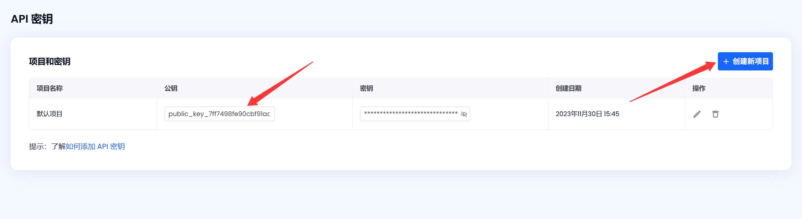

[English](README.md) | [繁體中文](README_TW.md) | [简体中文](README_CN.md)

# DocSlight - 开源文档解析与文档数据提取引擎

使用 [DocSlight](https://www.compdf.com/ai/docslight?utm_source=github_ai_docslight_newopen&utm_medium=referral&utm_campaign=ai_docslight_open&ref_platform_id=github_compdf_cn)，精准解析并提取任意文档中的数据——包括 PDF、扫描件、图片和 Office 文件。这是来自 ComPDF（KDAN 生态系统）的开源 AI 项目。

> - 如果你觉得 DocSlight 有帮助，欢迎在 GitHub 上给我们一个 ⭐ **Star**——这能帮助我们成长和改进！
> - 有问题或想法？欢迎加入我们的 [Discussions](https://github.com/ComPDF/docslight/discussions) 参与讨论。

<p align="center">
  <a href="#"></a>
  <a href="#"></a>
  <a href="#"></a>
  <a href="#"></a>
  <a href="#"></a>
</p>

<p align="center">
  <a href="#快速开始"><b>快速开始</b></a> •
  <a href="#产品版本对比"><b>产品版本对比</b></a> •
  <a href="#使用方式"><b>使用方式</b></a> •
  <a href="#效果测试与竞品对比"><b>效果测试与竞品对比</b></a> •
  <a href="https://compdf.com" target="_blank"><b>Cloud API →</b></a> •
  <a href="https://www.compdf.com/zh-cn/guides/api-reference/v2/ai/overview?utm_source=github_ai_docslight_newopen&utm_medium=referral&utm_campaign=ai_docslight_open&ref_platform_id=github_compdf_cn" target="_blank"><b>文档</b></a>
</p>

## 为什么选择 DocSlight？

与传统 OCR 工具不同，DocSlight 将 AI 驱动的文档解析、80+ 种语言的 OCR 以及结构化数据提取整合到一个开源平台中——既可本地部署，也可通过云端 API 使用，准确率更高。

### 核心优势

- 开源文档数据提取引擎——无厂商锁定
- 支持 80+ 语言 OCR，具备多语言自动检测
- 结构化字段提取，支持边界框（Bounding-Box）溯源
- Markdown / JSON 输出，便于下游处理
- 提供 Web UI + CLI + Python SDK
- 支持本地部署或 Cloud API
- 专为 RAG、AI Agent 和企业文档工作流打造

### 适用场景

- RAG 流水线与知识库构建
- 发票处理与文档信息提取
- 合同分析与条款解析
- AI 助手与 AI Agent 工具集成
- 企业文档自动化与智能文档处理（IDP）

无论你是在构建个人 RAG 项目，还是大型企业文档自动化系统，DocSlight 都能为文档理解提供可扩展的坚实基础。


## 快速开始

### 云端模式（更高精度，提供免费额度）

```bash
# 1. 安装
pip install docslight

# 2. 设置 API 密钥
export COMPDF_API_KEY="your_public_key"    # 前往 https://compdf.com 获取

# 3. 使用云端引擎解析
docslight parse invoice.pdf --mode cloud --output invoice.md
```

**获取API Key：** [登录 ComPDF 控制台](https://www.compdf.com/compdf-portal/signin?utm_source=github_ai_docslight_newopen&utm_medium=referral&utm_campaign=ai_docslight_open&ref_platform_id=github_compdf_cn)。 在 API 密钥页面创建或复制您的 publicKey。



### 本地模式（免费，无需注册）

```bash
# 1. 安装
pip install docslight

# 2. 解析文档
docslight parse invoice.pdf --mode local --output invoice.md

# 3. 获取结构化结果
ls invoice.zip
```


### Web UI（浏览器）

```bash
# 启动 Web 界面
git clone https://github.com/ComPDF/docslight.git

cd docslight

docker compose -f docker/docker-compose.yml up
# 打开 http://localhost:3022 → 拖拽文件即可
```
以上功能均可在 [ComPDF](https://www.compdf.com/?utm_source=github_ai_docslight_newopen&utm_medium=referral&utm_campaign=ai_docslight_open&ref_platform_id=github_compdf_cn) 上体验使用，→[体验地址](https://www.compdf.com/demo/idp/document-parsing?utm_source=github_ai_docslight_newopen&utm_medium=referral&utm_campaign=ai_docslight_open&ref_platform_id=github_compdf_cn)


## 产品版本对比

> 需要工作流自动化、RBAC、审计日志、私有部署或专属支持？ **了解企业版：** [https://www.compdf.com/ai/docslight](https://www.compdf.com/ai/docslight??utm_source=github_ai_docslight_newopen&utm_medium=referral&utm_campaign=ai_docslight_open&ref_platform_id=github_compdf_cn)

| 功能特性                              | DocSlight Lite（本地） | DocSlight-Lite（云端） | DocSlight Enterprise（SaaS） | DocSlight Enterprise（私有化部署） |
| --------------------------------- |:------------------:|:------------------:|:--------------------------:|:---------------------------:|
| 本地文件上传                            | ✅                  | ✅                  | ✅                          | ✅                           |
| 云端文件上传                            | ❌                  | ❌                  | ✅                          | ✅                           |
| DMS 文件上传                          | ❌                  | ❌                  | ✅                          | ✅                           |
| 扫描仪文件上传                           | ❌                  | ❌                  | ✅                          | ✅                           |
| PDF 解析                            | ✅                  | ✅                  | ✅                          | ✅                           |
| 图片解析                              | ✅                  | ✅                  | ✅                          | ✅                           |
| Word / PPT / Excel 解析             | ✅                  | ✅                  | ✅                          | ✅                           |
| Markdown 输出                       | ✅                  | ✅                  | ✅                          | ✅                           |
| JSON 输出                           | ✅                  | ✅                  | ✅                          | ✅                           |
| PDF 数据提取                          | 需要本地 LLM           | ✅                  | ✅                          | ✅                           |
| 图片数据提取                            | 需要本地 LLM           | ✅                  | ✅                          | ✅                           |
| Word / PPT / Excel 数据提取           | 需要本地 LLM           | ✅                  | ✅                          | ✅                           |
| 旧版 Office 格式解析与提取（.doc/.ppt/.xls） | ❌                  | ✅                  | ✅                          | ✅                           |
| 批量处理                              | ✅                  | ❌                  | ✅                          | ✅                           |
| 自动分类                              | ❌                  | ❌                  | ✅                          | ✅                           |
| 人工审核工作流                           | ❌                  | ❌                  | ✅                          | ✅                           |
| 复杂版面分析                            | 基础                 | 高级                 | 高级                         | 高级                          |
| OCR 优化                            | 基础                 | 高级                 | 高级                         | 高级                          |
| 结果溯源                              | ❌                  | ❌                  | ✅                          | ✅                           |
| 结果后处理                             | ❌                  | ❌                  | ✅                          | ✅                           |
| 智能结果审核                            | ❌                  | ❌                  | ✅                          | ✅                           |
| 自定义规则告警                           | ❌                  | ❌                  | ✅                          | ✅                           |
| Webhook 集成                        | ❌                  | ❌                  | ✅                          | ✅                           |
| API 管理                            | ❌                  | 有限                 | ✅                          | ✅                           |
| 知识库集成                             | ❌                  | ❌                  | ✅                          | ✅                           |
| 审计日志                              | ❌                  | ❌                  | ✅                          | ✅                           |
| RBAC                              | ❌                  | ❌                  | ✅                          | ✅                           |
| 多租户支持                             | ❌                  | ❌                  | ❌                          | ✅                           |
| 私有化部署                             | 仅限本地               | ❌                  | ❌                          | ✅                           |
| 专用 GPU                            | ❌                  | ❌                  | 可选                         | ✅                           |


## 输入/输出格式矩阵

| 输入类型 | 扩展名 | 云端解析 | 本地解析 | 云端提取 | 本地提取 | 解析输出 | 提取输出 | 说明 |
| -------- | ------ |:--------:|:--------:|:--------:|:--------:| -------- | -------- | ---- |
| PDF | `.pdf` | ✅ | ✅ | ✅ | ✅ 需要本地 LLM | Markdown、JSON、标准 JSON、ZIP | JSON | 本地 PDF 解析会使用栅格化/OCR 流程。 |
| 图片 | `.png`、`.jpg`、`.jpeg`、`.tif`、`.tiff`、`.bmp`、`.webp` | ✅ | ✅ | ✅ | ✅ 需要本地 LLM | Markdown、JSON、标准 JSON、ZIP | JSON | 本地图片解析会将每张图片视为一页。 |
| Word | `.docx` | ✅ | ✅ | ✅ | ✅ 需要本地 LLM | Markdown、JSON、标准 JSON、ZIP | JSON | 本地不支持旧版 `.doc`。 |
| PowerPoint | `.pptx` | ✅ | ✅ | ✅ | ✅ 需要本地 LLM | Markdown、JSON、标准 JSON、ZIP | JSON | 本地不支持旧版 `.ppt`。 |
| Excel | `.xlsx` | ✅ | ✅ | ✅ | ✅ 需要本地 LLM | Markdown、JSON、标准 JSON、ZIP | JSON | 本地不支持旧版 `.xls`。 |
| 旧版 Office | `.doc`、`.ppt`、`.xls` | 取决于云端 API 支持 | ❌ | 取决于云端 API 支持 | ❌ | 云端结果格式 | JSON | 本地处理前请先转换为 `.docx`、`.pptx` 或 `.xlsx`。 |

`docslight convert-parse-json` 接收本地解析的 JSON 对象，并输出标准解析的 JSON schema；它不直接处理原始文档文件。


## 安装与首次运行

DocSlight 支持 Python 3.10 到 3.13。

```bash
pip install "docslight"
```

云端模式需要网络访问和有效的 ComPDF Cloud API Key。本地模式默认使用 CPU；OCR 和 LLM 的耗时取决于文档大小、硬件性能和所选模型。


## 使用场景

- **RAG 流水线** — 解析文档 → 向量化嵌入 → LLM 查询
- **发票处理** — 提取发票号、日期、金额、明细项
- **合同分析** — 解析条款、当事方、日期，支持边界框溯源
- **文档数字化** — 批量将扫描档案转换为可搜索文本
- **AI Agent 集成** — 为 Claude / ChatGPT 提供 MCP 文档读取服务

可运行的示例代码位于 [`examples/`](docslight_lite/examples/)：

- [`cloud_parse.py`](docslight_lite/examples/cloud_parse.py)
- [`cloud_extract.py`](docslight_lite/examples/cloud_extract.py)
- [`local_parse.py`](docslight_lite/examples/local_parse.py)
- [`local_extract_ollama.py`](docslight_lite/examples/local_extract_ollama.py)
- [`local_extract_openai_compatible.py`](docslight_lite/examples/local_extract_openai_compatible.py)
- [`path_examples.py`](docslight_lite/examples/path_examples.py)


## 使用方式

### Python SDK

```python
from docslight import Parser

# 本地模式 — 开源 OCR 和文档解析
parser = Parser(mode="local")
result = parser.parse("contract.pdf")
print(result.text)                    # 完整 Markdown 文本
print(result.metadata)                # 页码、区块、边界框

# 云端模式 — 更高精度的 PDF 解析
parser = Parser(mode="cloud", api_key="your_key")
result = parser.parse("invoice.pdf")
print(result.text)
print(result.tables)                  # 结构化表格数据
print(result.blocks[0].bbox)          # 边界框溯源
```

### CLI

```bash
# 解析 PDF 为 Markdown
docslight parse document.pdf --mode cloud -o document.md

# 解析为 JSON 或标准 JSON
docslight parse scan.png --mode cloud --format json -o scan.json
docslight parse scan.png --mode cloud --format standard-json -o standard.json

# 解析并输出 ZIP 归档
docslight parse invoice.pdf --mode local --format zip -o invoice.zip

# 字段提取（云端模式）
docslight extract invoice.pdf --mode cloud --fields invoice_no,date,total
docslight extract invoice.pdf --schema schema.json
docslight extract invoice.pdf --document-types document-types.json

# 本地 LLM 提取
docslight extract invoice.pdf --mode local --fields invoice_no,total --local-llm-provider ollama --local-llm-model llama3.1

# 转换本地解析 JSON 为标准解析 JSON
docslight convert-parse-json parse.json -o standard.json

# 启动本地 API 服务
docslight web --host 127.0.0.1 --port 8000 --debug
```

#### CLI 命令

```bash
docslight parse INPUT [OPTIONS]
docslight extract INPUT [OPTIONS]
docslight convert-parse-json INPUT [OPTIONS]
```

#### parse / extract 通用参数

| 参数 | 可选值 / 默认值 | 说明 |
| ---- | --------------- | ---- |
| `INPUT` | 文件路径 | 要处理的文档路径。 |
| `--mode` | `cloud`、`local`；默认来自配置/环境变量或 `cloud` | 选择 ComPDF Cloud 或本地离线处理。 |
| `--api-key` | 字符串 | 云端 API 密钥，覆盖 `COMPDF_API_KEY`。 |
| `--base-url` | URL；默认 `https://api-server.compdf.com` | 云端 API 基础 URL，覆盖 `DOCSLIGHT_BASE_URL`。 |
| `--local-parser` | 字符串 | 本地解析器选择器，当前作为本地解析器配置预留。 |
| `--local-llm-provider` | `ollama`、`openai`、`openai-compatible`；使用任意本地 LLM 参数时默认 `ollama` | 本地结构化提取所用的 LLM 提供商。 |
| `--local-llm-model` | 字符串 | 本地结构化提取所用模型；本地 LLM 提取时必填。 |
| `--local-llm-base-url` | URL | 本地 LLM 端点。Ollama 默认 `http://localhost:11434`；OpenAI-compatible 提供商必须指定。 |
| `--local-llm-api-key` | 字符串 | 本地 LLM API 密钥。Ollama 默认 `ollama`。 |

#### parse 参数

| 参数 | 可选值 / 默认值 | 说明 |
| ---- | --------------- | ---- |
| `--output`、`-o` | 文件路径 | 将输出写入文件；不指定时输出到标准输出。 |
| `--format` | `markdown`、`json`、`standard-json`、`zip`；默认 `markdown` | 解析输出格式。若省略 `--output` 且以 `.zip` 结尾，会自动推断为 `zip`。 |

`markdown` 输出解析后的 Markdown；`json` 输出 SDK 解析结果；`standard-json` 输出标准解析 JSON schema；`zip` 输出原始解析归档，通常应配合 `--output` 使用。

#### extract 参数

| 参数 | 可选值 / 默认值 | 说明 |
| ---- | --------------- | ---- |
| `--output`、`-o` | 文件路径 | 将提取结果 JSON 写入文件；不指定时输出到标准输出。 |
| `--fields` | 逗号分隔字段名，例如 `invoice_no,total` | 指定需要提取的字段。 |
| `--schema` | JSON 文件路径 | 抽取 schema 的 JSON 文件。CLI 会读取该文件，并把 JSON 对象传给 `extract`；常见内容是 `{"fields": ["invoice_no", "date", "total"]}`。也兼容带 `properties` 的 JSON Schema 风格对象。 |
| `--document-types` | JSON 文件路径 | 文档类型路由文件；JSON 根节点必须是列表，例如 `["invoice", "receipt"]`。 |

`schema.json` 示例：

```json
{
  "fields": ["invoice_no", "date", "total"]
}
```

#### convert-parse-json 参数

| 参数 | 可选值 / 默认值 | 说明 |
| ---- | --------------- | ---- |
| `INPUT` | JSON 文件路径 | 要转换的本地解析 JSON；JSON 根节点必须是对象。 |
| `--output`、`-o` | 文件路径 | 将转换后的标准解析 JSON 写入文件；不指定时输出到标准输出。 |

#### 环境变量与配置文件

| 变量 | 说明 |
| ---- | ---- |
| `COMPDF_API_KEY` | 云端模式 API 密钥。 |
| `DOCSLIGHT_MODE` | 处理模式：`cloud` 或 `local`，默认 `cloud`。 |
| `DOCSLIGHT_BASE_URL` | 云端 API 基础 URL，默认 `https://api-server.compdf.com`。 |
| `DOCSLIGHT_TIMEOUT` | 云端请求超时时间，单位秒，默认 `30`。 |
| `DOCSLIGHT_LOCAL_PARSER` | 本地解析器选择器。 |

DocSlight 也会读取 `~/.docslight/config.toml`。配置优先级为：内置默认值、配置文件、环境变量、显式 SDK 或 CLI 参数。

```toml
mode = "cloud"
api_key = "your-api-key"
base_url = "https://api-server.compdf.com"
timeout = 30
local_parser = "paddleocr"  # 本地解析器配置预留

[local_llm]
provider = "ollama"
model = "llama3.1"
base_url = "http://localhost:11434"
api_key = "ollama"
timeout = 120
```

CLI 暴露了主要的本地 LLM 设置。`extra_body` 等高级本地 LLM 提供商设置可通过 SDK 或 `~/.docslight/config.toml` 配置。

### Docker

```bash
git clone https://github.com/ComPDF/docslight.git

cd docslight

docker compose -f docker/docker-compose.yml up
# 打开 http://127.0.0.1:3022
```

## 竞品对比

| 能力          | DocSlight | MinerU | PDF-Extract-Kit | ExtractThinker |
| ----------- |:---------:|:------:|:---------------:|:--------------:|
| PDF 解析      | ✅         | ✅      | ✅               | ⚠️             |
| OCR 支持      | ✅         | ⚠️     | ✅               | ❌              |
| 数据提取        | ✅         | ❌      | ❌               | ✅              |
| Web UI      | ✅         | ❌      | ❌               | ❌              |
| CLI         | ✅         | ✅      | ✅               | ❌              |
| Python SDK  | ✅         | ✅      | ✅               | ⚠️             |
| Cloud API   | ✅         | ❌      | ❌               | ❌              |
| 企业部署        | ✅         | ❌      | ❌               | ❌              |
| Markdown 输出 | ✅         | ✅      | ✅               | ⚠️             |
| JSON 输出     | ✅         | ✅      | ✅               | ✅              |
| 多语言 OCR     | ✅         | ⚠️     | ⚠️              | ❌              |
| 商业支持        | ✅         | ❌      | ❌               | ❌              |


## 架构

```text
┌─────────────────────────────────────────────────────────────────────────────────┐
│                           DocSlight 开源文档解析与提取引擎                        │
│                          （LGPL 协议 | 本地 + 云端双模式）                       │
└─────────────────────────────────────────────────────────────────────────────────┘
                                      │
                                      ▼
┌─────────────────────────────────────────────────────────────────────────────────┐
│                        接入方式层（入口）                                       │
├─────────────────────────────────────────────────────────────────────────────────┤
│                                                                                 │
│  ┌──────────────────────────┐   ┌────────────────────────┐  ┌───────────────────┐ │
│  │     Docker Web UI（主推）  │  │           CLI           │  │     Python SDK    │ │
│  │  一键容器化部署，开箱即用     │  │        命令行工具         │  │  原生代码集成      │ │
│  │                           │  │                         │  │                  │ │
│  │  docker compose -f        │  │docslight parse <file>   │  │  from docslight  │ │
│  │  docker/compose.yml up    │  │                         │  │  import Parser   │ │
│  │                           │  │docslight extract <file> │  │  parser.parse()  │ │
│  │  浏览器访问 http://localhost│  │                        │  │                   │ │
│  │  :3022                    │  │  docslight web         │  │                   │ │
│  └───────────────────────────┘  └────────────────────────┘  └───────────────────┘ │
│                                                                                 │
└─────────────────────────────────────────────────────────────────────────────────┘
                                      │
                                      ▼
┌─────────────────────────────────────────────────────────────────────────────────┐
│                           核心处理路由层（Router）                               │
│                   根据 --mode / 配置 自动切换 本地 / 云端 引擎                    │
└─────────────────────────────────────────────────────────────────────────────────┘
                                      │
                    ┌─────────────────┴─────────────────┐
                    │                                   │
                    ▼                                   ▼
┌───────────────────────────────────┐   ┌─────────────────────────────────────┐
│        🖥️ 本地模式（Lite Local）   │   │        ☁️ 云端模式（Lite Cloud）    │
│   （免费，离线运行，CPU 支持）     │   │   （高精度，需 API Key，GPU 加速） │
├───────────────────────────────────┤   ├─────────────────────────────────────┤
│  • 输入格式：                      │   │  • 输入格式：                       │
│    PDF / 图片 / 新版 Office       │   │    + 老格式 Office (.doc/.xls等)   │
│    (.docx/.pptx/.xlsx)           │   │                                     │
│  • 基础 OCR：PaddleOCR            │   │  • 高精度 VLM OCR 引擎             │
│  • 基础版面分析                   │   │  • 复杂版面分析（表格/公式/多栏）   │
│  • 字段抽取：需自配本地 LLM       │   │  • 内置 AI 字段抽取                │
│    （Ollama/OpenAI兼容）          │   │  • 边界框（BBox）精准溯源          │
│  • 输出：Markdown / JSON / Text   │   │  • 输出：Markdown / JSON / Text    │
└───────────────────────────────────┘   └─────────────────────────────────────┘
                    │                                   │
                    └─────────────────┬─────────────────┘
                                      │
                                      ▼
┌─────────────────────────────────────────────────────────────────────────────────┐
│                          AI 能力层（引擎模块）                                  │
├─────────────────────────────────────────────────────────────────────────────────┤
│                                                                                 │
│  ┌──────────────────┐  ┌──────────────────┐  ┌─────────────────────────────┐  │
│  │   OCR 引擎       │  │   结构分析器     │  │   字段抽取模块               │  │
│  │  • 本地：         │  │  • 区块分类      │  │  • 模板抽取                 │  │
│  │  PaddleOCR       │  │  • 表格检测      │  │  • 自定义字段               │  │
│  │  • 云端：         │  │  • 键值对映射    │  │  • 规则 + LLM 结合          │  │
│  │  VLM 引擎        │  │  • 公式识别      │  │  • BBox 溯源                │  │
│  └──────────────────┘  └──────────────────┘  └─────────────────────────────┘  │
│                                                                                 │
└─────────────────────────────────────────────────────────────────────────────────┘
                                      │
                                      ▼
┌─────────────────────────────────────────────────────────────────────────────────┐
│                           输出与生态层（Output & Ecosystem）                    │
├─────────────────────────────────────────────────────────────────────────────────┤
│                                                                                 │
│   ┌───────────────┐   ┌───────────────┐   ┌───────────────────────────────┐  │
│   │  标准输出格式  │   │  AI 生态集成  │   │  企业版扩展（SaaS / 私有化）  │  │
│   │  • Markdown   │   │  • LangChain  │   │  • 工作流编排                 │  │
│   │  • JSON       │   │  • LlamaIndex │   │  • 知识库 / DMS               │  │
│   │  • Text       │   │  • CrewAI     │   │  • RBAC / 审计日志            │  │
│   │  • 含 BBox    │   │  • AutoGen    │   │  • 智能审核 / 自定义规则      │  │
│   │    坐标溯源   │   │  • Haystack   │   │  • 多租户 / 私有化部署        │  │
│   └───────────────┘   └───────────────┘   └───────────────────────────────┘  │
│                                                                                 │
│   ┌──────────────────────────────────────────────────────────────────────────┐ │
│   │  目标场景：RAG 流水线 / AI Agent / 企业文档自动化 / 智能文档处理（IDP） │ │
│   └──────────────────────────────────────────────────────────────────────────┘ │
└─────────────────────────────────────────────────────────────────────────────────┘
```


## 专为 AI Agent 与 RAG 打造

DocSlight 帮助开发者使用开源 PDF 解析和开源文档数据提取技术，构建现代化的 AI 文档工作流。

### 常见应用

- RAG 系统
- AI 助手
- 企业知识库
- AI Agent 工作流
- 文档搜索引擎
- MCP 应用
- 智能文档处理（IDP）——适用于任意规模的开源 IDP

### 兼容生态

- OpenAI
- Claude
- Ollama
- LangChain
- LlamaIndex
- CrewAI
- AutoGen
- Haystack

### 典型工作流

```
PDF / 图片 / Office 文档
            ↓
        docslight
            ↓
Markdown / JSON 输出
            ↓
向量数据库
            ↓
LLM / AI Agent
            ↓
答案与自动化
```


## 效果测试与竞品对比

| 模型类型              | 方法               | 参数量  | 综合得分↑     | TextEdit↓ | FormulaCDM↑ | TableTEDS↑ | TableTEDS-S↑ | Read OrderEdit↓ |
| ----------------- | ---------------- | ---- | --------- | --------- | ----------- | ---------- | ------------ | --------------- |
| **DocSlight（云端）** | Specialized VLMs | 0.9B | **96.45** | 0.0321    | **97.76**   | **94.80**  | **97.02**    | 0.131           |
| MinerU2.5-Pro     | Specialized VLMs | 1.2B | 95.75     | 0.036     | 97.45       | 93.42      | 95.92        | 0.120           |
| GLM-OCR           | Specialized VLMs | 0.9B | 95.22     | 0.044     | 97.18       | 92.83      | 95.39        | 0.133           |
| PaddleOCR-VL-1.5  | Specialized VLMs | 0.9B | 94.93     | 0.038     | 96.89       | 91.67      | 94.37        | 0.130           |
| Ovis2.6-30B-A3B   | Specialized VLMs | 30B  | 93.70     | 0.035     | 95.17       | 89.44      | 92.40        | 0.135           |
| Logics-Parsing-v2 | Specialized VLMs | 4B   | 93.33     | 0.041     | 95.65       | 88.42      | 91.98        | 0.137           |
| HunyuanOCR        | Specialized VLMs | 1B   | 89.95     | 0.088     | 87.68       | 91.01      | 93.23        | 0.171           |
| Qwen3-VL-235B     | General VLMs     | 235B | 89.78     | 0.063     | 92.55       | 83.07      | 86.75        | 0.166           |
| Dolphin-v2        | Specialized VLMs | 3B   | 89.50     | 0.069     | 91.01       | 84.40      | 87.44        | 0.150           |
| GPT-5.2           | 通用 VLM           | -    | 86.59     | 0.114     | 88.21       | 82.95      | 87.93        | 0.193           |
| Mistral OCR       | Specialized VLMs | -    | 85.66     | 0.097     | 89.91       | 76.78      | 80.93        | 0.171           |
| Nanonets-OCR-s    | Specialized VLMs | 3B   | 83.61     | 0.108     | 81.46       | 80.18      | 84.51        | 0.213           |
| Marker            | Pipeline Tools   | -    | 78.44     | 0.157     | 85.24       | 65.77      | 73.24        | 0.243           |

> **方法说明：** 基于人工标注的真实数据，以字符级准确率衡量，测试集涵盖 500+ 份企业文档（发票、合同、表格、报告）。测试集可在 [benchmarks/dataset](https://github.com/opendatalab/OmniDocBench) 获取。


## 安装包说明

| 包                | 描述                  |
|------------------|---------------------|
| `docslight`      | 核心 CLI + Python SDK |   

```bash
pip install "docslight"
```


## 支持

有建议？立即[发起讨论](https://github.com/ComPDF/docslight/discussions)。如果你觉得 DocSlight 有帮助，欢迎在 GitHub 上给我们一个 ⭐ **Star**——这能帮助我们成长和改进！


## 📄 许可证

DocSlight 采用 [LGPL](LICENSE) 开源协议发布。

商业 / 企业许可证（支持 GPU 私有化部署）可在 [compdf.com](https://www.compdf.com/compdf-portal/signin?utm_source=github_ai_docslight_newopen&utm_medium=referral&utm_campaign=ai_docslight_open&ref_platform_id=github_compdf_cn) 获取。


<p align="center">
  <b>由 ComPDF 团队打造。</b><br>
  <a href="https://compdf.com?utm_source=github_ai_docslight_newopen&utm_medium=referral&utm_campaign=ai_docslight_open&ref_platform_id=github_compdf_cn">官网</a> ·
  <a href="https://www.compdf.com/zh-cn/guides/api-reference/v2/ai/overview?utm_source=github_ai_docslight_newopen&utm_medium=referral&utm_campaign=ai_docslight_open&ref_platform_id=github_compdf_cn">文档</a> ·
  <a href="https://www.compdf.com/contact-sales?utm_source=github_ai_docslight_newopen&utm_medium=referral&utm_campaign=ai_docslight_open&ref_platform_id=github_compdf_cn">企业咨询</a>
</p>
